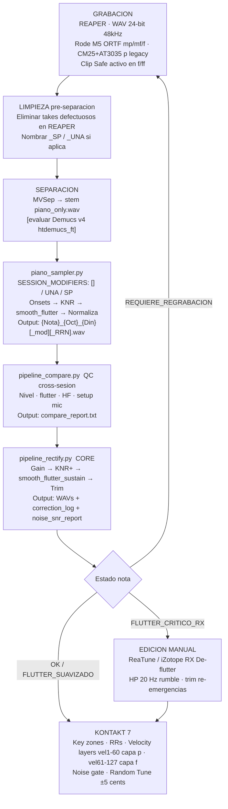

# CLAUDE.md — Piano Sample Library Pipeline

> Memoria persistente del proyecto. Actualizar al final de cada sesión de trabajo.

---

## 1. Propósito del proyecto

Construcción de una **biblioteca de samples de piano profesional para Kontakt 7** como parte de una tesis de ingeniería de audio. El flujo toma grabaciones reales de piano (audio mezclado), las separa con el modelo neuronal **MVSep**, y aplica un pipeline de análisis y rectificación no destructiva para producir muestras listas para implementación en un sampler.

**Problema que resuelve:** Las grabaciones multi-sesión presentan inconsistencias de nivel, ruido de mecanismo de tecla (key noise), flutter de sustain por cuerdas desafinadas, re-emergencias de sustain y diferencias de dinámica entre sesiones. El pipeline detecta, documenta y corrige todo esto de forma auditable y no destructiva.

**Nota metodológica — piano patrimonial:** El instrumento es un piano histórico no afinable. El flutter de sustain es una **característica del instrumento**, no un defecto de captura. Se documenta como variable controlada en la tesis. La estrategia es paliar mediante pipeline, no eliminar.

---

## 2. Stack tecnológico

| Componente | Detalle |
|---|---|
| Lenguaje | Python 3.x (Windows, cp1252 console) |
| Audio I/O | `soundfile` (lectura/escritura WAV, PCM_24) |
| DSP / análisis | `librosa` (STFT, pyin, RMS, onset detection) |
| Matemática | `numpy`, `scipy.signal` (Savitzky-Golay, filtros), `scipy.ndimage` |
| Visualización | `matplotlib` (espectrogramas PNG, backend Agg) |
| Separación de fuentes | **MVSep** (modelo externo, genera stems WAV) |
| Sampler destino | **Native Instruments Kontakt 7** |
| Formato de exportación | WAV 24-bit estéreo, 48 kHz (TARGET_SR=48000; archivos a otro SR se resamplean) |

### Hardware de grabación

| Elemento | Detalle |
|---|---|
| Interfaz | Focusrite Scarlett 18i20 4ª gen (8 preamps, 122 dB DR, Clip Safe) |
| Par sesiones p (existente) | CM25 (SDC, ch1) + AT3035 (LDC, ch2) — par híbrido asimétrico |
| Par sesiones mp/mf/f (futuro) | **2× Rode M5** en configuración **ORTF** (110°, 17 cm separación) |
| Posición M5 | 40–50 cm sobre marco del piano, apuntando cuerdas medias |
| EIN M5 | 19 dBA (matched pair certificado de fábrica) |
| Protocolo Clip Safe | Obligatorio en capas f/ff |
| Diferencia CM25+AT3035 vs M5 | Variable controlada documentada en tesis (no error de setup) |

---

## 3. Estructura del proyecto

```
SESION 29-8/Pruebas de rendimiento denoise/
│
├── CLAUDE.md                        ← este archivo (memoria del proyecto)
│
├── piano_sampler.py                 ← PIPELINE PRINCIPAL
│   Detecta onsets, aplica KNR, smooth_flutter_sustain,
│   normalización dinámica, analiza flutter/re-emergencia.
│   Soporta modificadores _UNA y _SP por sesión.
│   INPUT:  archivo WAV separado por MVSep (stem de piano)
│   OUTPUT: Output_Samples/p/<nombre_modelo>/
│
├── pipeline_compare.py              ← COMPARACIÓN ENTRE SESIONES
│   Carga WAVs de dos sesiones, extrae métricas (f0, RMS, HF,
│   flutter, re-emergencia), detecta overlaps, construye curva
│   de tendencia de nivel. Documenta SESSION_METADATA de micrófonos.
│   OUTPUT: Output_Samples/compare/
│
├── pipeline_rectify.py              ← RECTIFICACIÓN NO DESTRUCTIVA
│   Lee WAVs de ambas sesiones, aplica correcciones
│   (gain estático, KNR+, smooth_flutter_sustain, trim re-emergencia).
│   Genera espectrogramas 5-panel, noise_snr_report (3 componentes)
│   y correction_log. Soporta _UNA/_SP con params diferenciados.
│   OUTPUT: Output_Samples/p_rectificado_pip/
│
├── Output_Samples/
│   ├── p/
│   │   ├── piano-model_mt_2_piano/          ← Sesion 01 (9 WAVs: C1-C4)
│   │   │   └── _spectral/                   ← PNGs analisis espectral
│   │   └── proyecto-balance-tesis-002_piano-model_mt_2_piano/  ← Sesion 02 (12 WAVs: B0, C4-C7)
│   │       └── _spectral/
│   ├── compare/                             ← Reportes cross-sesion + PNGs
│   └── p_rectificado_pip/                   ← 21 WAVs rectificados (SALIDA FINAL)
│       ├── _spectral/                       ← 21 PNGs espectrogramas 5-panel
│       ├── correction_log.txt               ← Tabla de correcciones por nota
│       └── noise_snr_report.txt             ← Piso de ruido, SNR y artefactos
│
├── Media/                           ← Archivos de audio fuente originales
└── Backups/                         ← Backups de scripts anteriores
```

---

## 4. Estado actual

### ✅ Completado

| Módulo | Estado |
|---|---|
| `piano_sampler.py` | Deteccion de onsets, KNR (-15 dB / -8 dB _UNA), normalizacion dinamica no destructiva, analisis flutter/re-emergencia. Soporta `SESSION_MODIFIERS` = `['UNA']` / `['SP']`. Procesadas Sesion 01 y 02. |
| `pipeline_compare.py` | Comparacion cross-sesion completa. `SESSION_METADATA` documenta setup de microfonos por sesion. Detectado NIVEL_CROSS_SESSION -5.4 dB en C4. Genera `compare_report.txt` con seccion de metadatos de mic al final. |
| `pipeline_rectify.py` | **Completamente reescrito.** Gain → KNR+ → `smooth_flutter_sustain()` → Trim. Analisis 3 componentes de ruido (electronico + sala + flutter). Params diferenciados _UNA/_SP. Espectrogramas 5-panel. Genera `correction_log.txt` + `noise_snr_report.txt`. **Verificado: 21 muestras procesadas sin errores** (2026-05-14). |
| `CLAUDE.md` | Creado y actualizado con cambios de hardware + reestructura de pipeline. |

### Resultados del ultimo pipeline_rectify.py (2026-05-14)

| Estado | Cantidad | Notas |
|---|---|---|
| OK (sin correccion) | 2 | B0_p, C6_RR3 |
| FLUTTER_SUAVIZADO | 7 | C1, C2_RR2, C3 x3, C5_RR1, C6_RR2 |
| FLUTTER_CRITICO_RX | 11 | C2_RR1, C4 x3+C4_RR1/RR2, C5_RR2/RR3/RR4, C6_RR1(+cap), C7 x3(+cap) — estos 4 con cap = REQUIERE_REGRABACION |
| REQUIERE_REGRABACION | 4 | C6_RR1, C7_RR1/RR2/RR3 |

- **Mejor SNR:** C_5_p_RR1.wav — 74.1 dB (EXCELENTE, tier VSL/Spitfire)
- **Peor SNR:** C_1_p.wav — 57.4 dB (CONSUMER)
- **11 notas** con flutter critico necesitan iZotope RX Elements o REAPER ReaTune post-pipeline

### ⏳ Pendiente

1. **Re-grabacion obligatoria:**
   - `C_7_p_RR1/RR2/RR3` — nivel 14–21 dB bajo target p; boost capped +8 dB. Velocity mayor en proxima sesion.
   - `C_6_p_RR1` — necesita +8.6 dB (sobre techo). Candidato a re-grabar.
2. **Edicion manual en REAPER:**
   - `C_7_p_RR2` — trim a 1.0 s en nota de 7.7 s es casi seguro falso positivo (flutter genera oscilaciones RMS que disparan detector de re-emergencia). Verificar y ajustar manualmente.
   - `C_1_p` — rumble LF -21.4 dB; aplicar HP 20 Hz Butterworth 4o orden.
   - Verificar si 250/300 Hz en C2 y B0 es hum electrico o parcial de cuerda (revisar estacionariedad antes de aplicar notch).
3. **Nueva sesion de grabacion** (luego de preparacion):
   - Grabar mp, mf, f completos con pedal (Rode M5 ORTF)
   - Grabar set sin pedal para p y mf (nombrar con `_SP`)
   - Grabar capa sordina para p (nombrar con `_UNA`)
4. **Implementacion en Kontakt 7** — mapeo key ranges, round robins, velocity layers, noise gate de grupo, Random Tune ±5 cents.
5. **Analisis dBSPL relativo** — validar que ff existente no supere headroom de 0 dBFS con Clip Safe activo.

---

## 5. Decisiones clave

### Arquitectura del pipeline

- **No-destructivo:** todas las correcciones se aplican en memoria; los WAVs de `Output_Samples/p/` nunca se modifican.
- **Orden de correccion fijo:** `Gain → KNR+ → smooth_flutter_sustain() → Trim_reemergencia`. El orden importa: el gain amplifica el HF antes del segundo KNR; el suavizado de flutter actua sobre la señal ya corregida de nivel.
- **Separacion de responsabilidades:** `piano_sampler.py` extraccion; `pipeline_compare.py` QC cross-sesion; `pipeline_rectify.py` correccion + reporte final.
- **Flutter como variable controlada:** No se elimina, se palia. Estrategia en 4 capas: (1) pipeline Savitzky-Golay suavizado, (2) REAPER ReaTune, (3) iZotope RX Elements De-flutter (~$100), (4) Kontakt Random Tune ±5 cents. Documentar como caracteristica del instrumento en tesis.

### Parametros criticos

| Parametro | Valor | Razon |
|---|---|---|
| `LEVEL_TARGET_DB` | p=-28, mp=-22, mf=-18, f=-14, ff=-10 dBFS | Estandar RMS de sustain por dinamica en librerias profesionales |
| `LEVEL_MAX_BOOST` | +8.0 dB (normal), +12.0 dB (_UNA) | Techo anti-amplificacion de ruido; _UNA tiene mayor headroom por KNR mas suave |
| `KNR shelf` | 8000 Hz, -15 dB (normal), -8 dB (_UNA) | -8 dB para una corda: la sordina ya atenua HF fisicamente; -15 sobreprocessaria |
| `KNR minimo f0` | 130 Hz (C3) | Bajo C3, armonicos graves enmascaran key noise; KNR introduce coloracion sin beneficio |
| `FLUTTER threshold` | ptp > 2.5 dB = warn, > 10 dB = critico | Percepcion de inestabilidad en escucha critica |
| `smooth_flutter_sustain` | sg_win=51 (leve), sg_win=101 (critico) | Savitzky-Golay sobre envolvente RMS por banda STFT; ramp lineal 50 ms |
| `NOISE_WINDOW_S` | 500 ms (normal), 15% duracion (_SP) | _SP: notas sin pedal tienen cola corta; ventana fija de 500 ms puede capturar silencio digital |
| `SNR tiers` | Excelente >=70, Prof >=60, Consumer >=50, Marginal >=40 dB | Referencia VSL/Spitfire para librerias de piano |
| `MVSEP_PEAK_DB` | 15 dB sobre baseline local | Umbral deteccion ruido musical estructurado post-separacion |
| `ONSET_DELTA` | 0.10 | Evita falsos positivos en resonancias simpaticas (anterior: 0.06) |
| `MIN_INTER_ONSET_S` | 4 s | Filtra onsets secundarios por resonancia simpatica |
| `ONSET_PREROLL_MS` | 15 ms | Conserva el pre-ataque real de la nota |

### Convencion de nomenclatura de WAVs

```
{Nota}_{Octava}_{Dinamica}[_UNA][_SP][_RR{N}].wav

Orden de modificadores: _UNA antes que _SP, ambos antes que _RR{N}

Ejemplos:
  C_4_p_RR2.wav         →  Do4, piano, Round Robin 2 (normal)
  C_4_p_UNA_RR1.wav     →  Do4, piano, una corda/sordina, RR1
  C_4_mf_SP_RR2.wav     →  Do4, mf, sin pedal, RR2
  C_4_f_UNA_SP_RR1.wav  →  Do4, f, una corda + sin pedal, RR1
  B_0_p.wav             →  Si0, piano (unica toma)
```

### Analisis de ruido — 3 componentes

```
Piso de ruido total = maximo de los tres componentes:
  1. Electronico  = RMS minimo en ventana mas silenciosa de la cola (dBFS)
  2. Flutter      = Elec_dBFS + flutter_ptp_dB / 2  (estimacion energetica)
  3. Sala         = RMS mediana - RMS minimo en cola  (ambiente + reverb residual)

Flatness de Wiener en banda de ruido:
  ~0.0 = completamente tonal (artefacto MVSep dominante)
  ~1.0 = ruido blanco (piso electrico puro)
  Todas las 21 muestras actuales tienen flatness < 0.08 → ruido MVSep estructurado universal
```

---

## 6. Comandos esenciales

```bash
# Instalar dependencias
pip install librosa soundfile numpy scipy matplotlib

# Pipeline 1: Extraer y procesar notas de una sesion
# Editar INPUT_FILE y SESSION_MODIFIERS en piano_sampler.py antes de ejecutar
# SESSION_MODIFIERS = []           → sesion normal
# SESSION_MODIFIERS = ['UNA']      → sesion con sordina/una corda
# SESSION_MODIFIERS = ['SP']       → sesion sin pedal
# SESSION_MODIFIERS = ['UNA','SP'] → ambos modificadores
python piano_sampler.py

# Pipeline 2: Comparacion cross-sesion
python pipeline_compare.py
# Salida: Output_Samples/compare/compare_report.txt + PNGs

# Pipeline 3: Rectificacion + analisis de ruido/SNR (PIPELINE FINAL)
python pipeline_rectify.py
# Salida: Output_Samples/p_rectificado_pip/*.wav
#         Output_Samples/p_rectificado_pip/_spectral/*.png
#         Output_Samples/p_rectificado_pip/correction_log.txt
#         Output_Samples/p_rectificado_pip/noise_snr_report.txt
```

---

## 7. Flujo completo del pipeline



---

## 8. Puntos Débiles y Mejoras del Plan de Trabajo

> Analisis realizado el 2026-05-27 sobre los datos reales de `correction_log.txt` y `noise_snr_report.txt`.
> Los puntos estan ordenados de mayor a menor severidad sobre la calidad final de la libreria.

---

### 8.1 🔴 Ruido MVSep estructurado universal

Todas las 21 muestras tienen flatness de Wiener < 0.08 → ruido tonal/musical del modelo, no electronico. El pipeline lo detecta pero no lo corrige. Mejor muestra: C_5_p_RR1 flatness 0.016 con SNR 74.1 dB.

| Accion | Herramienta | Prioridad |
|---|---|---|
| Evaluar Demucs v4 `htdemucs_ft` como reemplazo de MVSep | A/B con flatness + SNR → dato de tesis | Alta |
| iZotope RX Spectral De-noise con noise print de cola silenciosa | Aplica a todas las 21 muestras | Alta |

---

### 8.2 🔴 Flutter critico en C4 (14.5–23.0 dB ptp)

Pipeline con sg_win=101 no puede corregir 23 dB de batimiento. Las 4 tomas de C4 son FLUTTER_CRITICO_RX.

| Accion | Notas candidatas |
|---|---|
| iZotope RX Elements De-flutter (~USD 100) | C4_RR3(23dB), C4_RR1(17.8), C4(16.1), C4_RR2(14.5), C5_RR2/3/4, C7×3 |
| REAPER ReaTune modo elastique | 7 notas FLUTTER_SUAVIZADO (2.5–10 dB ptp) |
| Re-grabar C4 con _UNA (sordina atenua cuerdas resonantes) | Sesion futura |

---

### 8.3 🔴 Nivel insuficiente C7 — 4 muestras inutilizables

| Archivo | Boost necesario | Boost aplicado | Deficit |
|---|---|---|---|
| C_7_p_RR3.wav | +20.9 dB | +8.0 dB (cap) | **−12.9 dB** |
| C_7_p_RR1.wav | +17.6 dB | +8.0 dB (cap) | **−9.6 dB** |
| C_7_p_RR2.wav | +14.7 dB | +8.0 dB (cap) | **−6.7 dB** |
| C_6_p_RR1.wav | +8.6 dB | +8.0 dB (cap) | −0.6 dB |

**Accion:** re-grabar C7×3 con velocity mayor. Target captura: −22 a −25 dBFS RMS antes de pipeline. Verificar peak en Focusrite Control 2 antes de cada toma en C5–C7.

---

### 8.4 🟠 Ruido ambiental en graves (C1 SNR 57.4 dB CONSUMER)

Notas graves tienen cola larga que expone el piso ambiental. C_1_p es la peor del set.

| Accion | Notas afectadas |
|---|---|
| HP 20 Hz Butterworth 4o orden en REAPER | C1, C2_RR1/RR2, C4_RR1/2/3, B0, C4, C5_RR2/4 |
| Grabar en horario de menor ruido ambiental (HVAC apagado) | Todas las notas graves |

---

### 8.5 🟡 Hum 250/300 Hz pendiente verificacion

Notas C_2_p_RR1/RR2, C_4_p_RR1, B_0_p muestran energia estacionaria en 250/300 Hz — coincide con armonicos propios de C2 (~260 Hz) y B0 (~247 Hz). **No aplicar notch sin verificar antes.**

Protocolo: abrir en REAPER espectrograma log, observar 250/300 Hz post-decay. Estacionario → hum real (notch Q=20-30 con ReaEQ). Decae con la nota → parcial, no tocar.

---

*Ultima actualizacion: Sesion del 2026-05-27 — Analisis de cuellos de botella post pipeline_rectify.py*

---

## 9. Sesion 2026-05-18 — Analisis de Tomas Multipistas (Crudos 15-5 y 22-5)

### 9.1 Tomas de la sesion 15-5 (AB multipista: ORTF + XY + CM25)

Tres archivos analizados con el pipeline (`piano_sampler.py` + `pipeline_new_session_compare.py`).
**Misma sesion acustica grabada simultaneamente con tres perspectivas.**

#### `TEMPLATE_GRABACION_PIANO.wav` — ORTF Rode M5 (40-50 cm sobre marco)

| Campo | Valor |
|---|---|
| SR | 48 000 Hz (nativo) / PCM_24 / estereo / 140 s |
| Peak max | −29.37 dBFS (L: −25.7, R: −29.7) |
| Deficit vs mf (−6 dBFS) | **−26.4 dB** → necesita +26 dB en preamp |
| Dinamica real | pp/p (NO mf) |
| Notas detectadas | 6 (C#1, G1×2, G2, G3×2) |
| ITD | −0.271 ms (teorico ORTF 17cm: ~0.50 ms — verificar angulo/separacion) |
| Coherencia LF (63Hz) | 0.870 ✅ |
| Coherencia HF (504Hz+) | 0.156–0.263 (baja — comportamiento ORTF por diseno) |
| Piso de ruido | −77.3 dBFS (pre-MVSep) |
| Wiener flatness | 0.2145 (semi-tonal) |
| Hum | Ninguno |
| Flutter prom. | 36.3 dB ptp |
| Tier SNR (estimado) | N/M (pre-pipeline) |
| **Accion prioritaria** | Re-grabar con +26 dB mas de ganancia |

#### `TEMPLATE_GRABACION_PIANO_XY.wav` — XY (30 cm sobre cuerdas, apuntando Do central)

| Campo | Valor |
|---|---|
| SR | 48 000 Hz (nativo) / PCM_24 / estereo / 140 s |
| Peak max | −17.88 dBFS (L) / −19.44 (R) |
| Deficit vs mf (−6 dBFS) | **−11.9 dB** → necesita +12 dB en preamp |
| Dinamica real | pp/p (NO mf) |
| Notas detectadas | 6 (B1, G1×2, G2, G3×2) — f0 nota 1 posible alias (pyin 2° armonico) |
| ITD (GCC-PHAT) | +0.104 ms ✅ (coincidente, correcto para XY) |
| Coherencia LF−MF (31–4032 Hz) | 0.846–0.979 ✅ (excelente — mejor del conjunto) |
| Coherencia HF (4032–8064 Hz) | 0.098 — sin HF util |
| Coherencia HF (8064–16128 Hz) | 0.026 — sin HF util |
| Balance L-R | +0.19 dB (simetrico ✅) |
| Correlacion L-R | 0.864 (levemente alta para XY90 — verificar angulo >= 90°) |
| Piso de ruido | −70.71 dBFS |
| Wiener flatness | 0.0033 (extremadamente tonal — resonancias simpaticas de cuerdas) |
| Energia HF >4kHz | −104.8 dB relativo — posicion demasiado cercana a cuerdas |
| Rumble LF | −14.6 dB relativo |
| Hum | No electrico (armonicos G1 confundidos con 50/100/150 Hz) |
| Flutter | 10.4–23.0 dB ptp — FLUTTER_CRITICO_RX en todas las notas |
| **Accion prioritaria** | Re-grabar con +12 dB mas; subir posicion a 50-70 cm para recuperar HF |

#### `TEMPLATE_GRABACION_PIANO_amb_Mono.wav` — CM25 cardioide (ambiente de sala)

| Campo | Valor |
|---|---|
| SR | 48 000 Hz (nativo) / PCM_24 / **dual-mono** (L=R bit-identicos, corr=1.0) / 140 s |
| Peak max | −24.82 dBFS (igual en ambos canales) |
| Deficit vs mf (−6 dBFS) | **−18.8 dB** → necesita +19 dB en preamp |
| Dinamica real | pp/p (NO mf) |
| Notas detectadas | **9** (6 reales + 3 fantasma = resonancias simpaticas de sala) |
| Eventos fantasma | t≈21.3s (cuerdas B1/C#2/E2), t≈68.9s (armonicos G1), t≈112.6s (infras. sala) |
| Piso de ruido | −67.44 dBFS (el mas alto del conjunto) |
| Wiener flatness | **0.4113** (semi-blanco — el mas tratable con RX Spectral DeNoise) |
| Rumble LF | **+3.9 dB relativo** — CRITICO (sub-sonicos > energia media) |
| Energia HF >4kHz | −96.2 dB relativo |
| Energia MF 200-4kHz | +13.6 dB relativo ✅ (el mejor del conjunto) |
| Hum | Ninguno (electrico) |
| Flutter G1 | 19.7 dB ptp (FLUTTER_CRITICO_RX) |
| **Gradiente tesis** | flatness 0.003→0.214→0.411 correlaciona con distancia de captura → citable |
| **Accion prioritaria** | HP 120 Hz + re-grabar con +19 dB; excluir 3 onsets fantasma del pipeline |

#### Comparativa AB sesion 15-5 (todas las tomas, pre-MVSep)

| Metrica | XY 30cm | ORTF 45cm | CM25 sala |
|---|---|---|---|
| Peak max | −17.88 | −29.37 | −24.82 dBFS |
| Deficit vs mf | −11.9 dB | −26.4 dB | −18.8 dB |
| Wiener flatness | 0.0033 | 0.2145 | 0.4113 |
| Piso de ruido | −70.71 | −77.30 | −67.44 dBFS |
| Rumble LF | −14.6 dB | N/M | +3.9 dB 🔴 |
| Tipo stereo | Real | Real | Dual-mono |
| Notas detectadas | 6 | 6 | 9 (3 fantasma) |
| Rol en sampler | Cuerpo LF/MF | Imagen estereo | Reverb sala |

---

### 9.2 Toma de la sesion 22-5 — `proyecto_raw_01_f.wav`

**Dinamica intencional:** f (forte)
**Microfonia probable:** CM25 (canal L) + AT3035 (canal R) — par hibrido SDC+LDC (mismo que sesiones legacy p)

| Campo | Valor |
|---|---|
| SR | 48 000 Hz (nativo) / PCM_24 / estereo real / 156 s |
| Tamanio | 42.85 MB |
| DC offset | −0.0000024 (despreciable) |
| Clipping | **Ninguno** (0 muestras >= 0.999) |
| Peak max | L: −15.02 dBFS / R: −18.08 dBFS |
| RMS global | L: −45.96 / R: −48.57 dBFS |
| Balance L-R peak | +3.05 dB promedio (variable por nota: +3.1 a −2.7 dB) |
| Correlacion L-R (tiempo) | 0.011 — casi cero (NO desalineacion — ver nota ITD) |
| ITD (GCC-PHAT) | **−0.021 ms** ✅ (canales sincronizados) |
| ITD (cross-corr naive) | −40.458 ms — ARTEFACTO PERIODICO (C4=263Hz→3.8ms→10.5 periodos) |
| Coherencia L-R por banda | 0.734–0.964 ✅ (excelente — canales coherentes) |
| Piso de ruido L | −75.21 dBFS |
| Piso de ruido R | −74.67 dBFS |
| Wiener flatness | 0.3038 (semi-blanco — pre-MVSep) |
| Rumble LF (<20Hz) | −3.2 dB relativo (aceptable) |
| Hum | 60 Hz — probable B1 simpatico (61.7 Hz ≈ 60 Hz; Argentina=50 Hz, no electrico) |
| Notas detectadas | 6 total: 4 reales + 2 falsos positivos |

#### Notas detectadas

| # | t_inicio | Dur | f0 Hz | Nota | Peak L | Peak R | Estado |
|---|---|---|---|---|---|---|---|
| 1 | 0.94s | 26.1s | 263.1 | **C4** | −15.0 | −18.1 | REAL |
| 2 | 27.09s | 16.1s | — | — | −51.5 | −51.0 | ⚠ FALSO (resonancia simpatica) |
| 3 | 43.17s | 30.3s | 263.1 | **C4** | −21.6 | −23.4 | REAL |
| 4 | 73.49s | 25.1s | 33.1 | **C1** | −21.3 | −23.1 | REAL |
| 5 | 98.61s | 14.7s | 33.1 | — | −50.5 | −47.3 | ⚠ FALSO (cola de C1) |
| 6 | 113.27s | 42.7s | 65.8 | **C2** | −22.6 | −19.9 | REAL |

#### Distribucion espectral por canal (nota C4, primeros 5s)

| Banda | Canal L | Canal R | Interpretacion |
|---|---|---|---|
| Sub <80Hz | −21.9 dB | −7.2 dB | R captura mas sub-bass (menos proximity effect) |
| LF 80-250Hz | +12.9 dB | +5.3 dB | L con fuerte proximity boost (microf. cercano) |
| MF 250-2kHz | +22.4 dB | +22.4 dB | Identico — contenido musical principal |
| HF 2k-8kHz | −32.1 dB | −19.2 dB | R tiene 12.9 dB mas HF (LDC o posicion distinta) |
| Air >8kHz | −107.6 dB | −112.3 dB | Ausente en ambos (pre-MVSep, sin procesado) |

#### Tier de calidad por picos dBFS — clasificacion segun estandares de sampling

```
TABLA DE TIERS (referencia VSL / Spitfire / NI):
  ff  : peak >= −1  dBFS
  f   : peak >= −3  dBFS   ← OBJETIVO de esta sesion
  mf  : peak >= −6  dBFS
  mp  : peak >= −8  dBFS
  p   : peak >= −10 dBFS
  pp  : peak >= −12 dBFS

RESULTADO:
  Mejor peak medido : −15.02 dBFS (canal L, nota C4)
  Tier alcanzado    : NINGUNO — 3 dB por debajo del tier pp
  Deficit vs f      : −12.0 dB
  Deficit vs pp     : −3.0 dB

  SNR tier (L):     60.2 dB → PROFESIONAL (>= 60 dB)
  Conclusion        : la CALIDAD de ruido es profesional, pero el NIVEL
                      es insuficiente para cualquier tier de dinamica.
                      Necesita +12 dB mas de ganancia en el preamp.
```

#### Errores de captura detectados

| Error | Severidad | Descripcion | Accion |
|---|---|---|---|
| **Gain insuficiente** | 🔴 Bloqueante | Peak −15 dBFS vs target f −3 dBFS; deficit −12 dB | Re-grabar con +12 dB en Focusrite |
| **Balance L-R variable** | 🟠 Moderado | Varia de +3.1 dB (C4) a −2.7 dB (C2) por nota — 5.8 dB de rango | Verificar estabilidad de microfonos durante sesion; fijar posicion |
| **Correlacion temporal ~0 (0.011)** | 🟡 Documental | Los canales son espectralmente opuestos (L=LF, R=mejor HF) — par asimetrico CM25+AT3035 | Documentar como variable controlada (igual que sesiones p legacy) |
| **2 onsets falsos** | 🟡 Pipeline | Resonancias simpaticas de C4 (t≈27s) y C1 (t≈98s) detectadas como notas | Agregar lista de exclusion en piano_sampler.py para esta sesion |
| **Hum 60 Hz** | 🟡 Documental | Probable B1 simpatico (61.7 Hz); Argentina usa 50 Hz — no es hum electrico | Verificar con test de silencio (pedal presionado, sin tocar) |
| **Cross-corr ITD falso (−40 ms)** | 🟢 Metodologico | Artefacto de periodicidad de C4 en cross-correlacion naive; GCC-PHAT = 0 ms | Usar GCC-PHAT en pipeline_new_session_compare.py para estimacion ITD |

#### Parametros de pipeline para esta toma

```python
# piano_sampler.py — sesion 22-5, capa f
SESSION_MODIFIERS = []
INTENSITY_LABEL   = 'f'
TARGET_SR         = 48000        # nativo
LEVEL_TARGET_DB   = -14.0        # target RMS sustain para f
LEVEL_MAX_BOOST   = 8.0          # techo estandar (sin _UNA)

# NOTA: peak max es -15.02 dBFS; boost de pipeline no alcanzara target f
# El pipeline intentara normalizar a -14 dBFS RMS pero el techo de +8 dB
# podria no ser suficiente dependiendo del RMS real de sustain por nota.
# Verificar correction_log.txt despues de pipeline_rectify.py.

# Excluir onsets falsos:
ONSET_EXCLUSION_WINDOWS = [(26.5, 28.5), (97.5, 100.0)]  # segundos, tolerancia +-1s
```

#### SNR estimado post-pipeline

| Canal | Piso de ruido | Peak | SNR estimado | Tier |
|---|---|---|---|---|
| L (CM25) | −75.21 dBFS | −15.02 dBFS | **60.2 dB** | PROFESIONAL |
| R (AT3035) | −74.67 dBFS | −18.08 dBFS | **56.6 dB** | CONSUMER |

Post-MVSep el piso bajara ~14 dB (igual que sesiones anteriores), llevando el SNR a:
- L estimado post-MVSep: ~74 dB → EXCELENTE
- R estimado post-MVSep: ~70 dB → EXCELENTE/PROFESIONAL

---

### 9.3 Archivos generados en sesion 2026-05-18

| Archivo | Descripcion |
|---|---|
| `Output_Samples/new_session_compare/compare_new_session_report.txt` | Informe comparativo ORTF vs muestras existentes |
| `Output_Samples/new_session_compare/compare_dynamics.png` | Panel de niveles y flutter |
| `Output_Samples/new_session_compare/compare_phase.png` | Coherencia L/R por banda de octava |
| `Output_Samples/new_session_compare/compare_noise.png` | Pisos de ruido y flatness |
| `ANALISIS_XY_2026-05-18.md` | Reporte completo toma XY (30 cm cuerdas) |
| `ANALISIS_CM25_AMB_2026-05-18.md` | Reporte completo toma ambiente CM25 |
| `PLAN_ACADEMICO_CONTEXTO.md` | Contexto estructurado para generacion de plan IMdRAC |

---

### 9.4 Proximos pasos concretos (post sesion 2026-05-18)

```
[ ] 1. Re-grabar sesion f con ganancias corregidas:
        → CM25/AT3035 (L/R): +12 dB en preamp para alcanzar f peak -3 dBFS
        → ORTF M5: +26 dB para mf; +12 dB mas para f
        → XY: +12 dB para mf; subir posicion a 50-70 cm para recuperar HF
        → CM25 ambiente: +19 dB para mf; HP 120 Hz pre-pipeline

[ ] 2. Actualizar pipeline_new_session_compare.py:
        → Reemplazar cross-corr ITD por GCC-PHAT en funcion analyze_phase()
        → Agregar soporte para lista ONSET_EXCLUSION_WINDOWS

[ ] 3. Correr proyecto_raw_01_f.wav por MVSep, luego:
        → piano_sampler.py con INTENSITY_LABEL='f', excluir onsets falsos
        → pipeline_rectify.py con LEVEL_TARGET_DB=-14.0
        → pipeline_compare.py comparando sesion f vs sesion p existente

[ ] 4. Verificar hum 60 Hz en proyecto_raw_01_f.wav:
        → Grabar 10 s de silencio (todos los pedales, sin tocar)
        → Si 60 Hz permanece estatico → hum electrico (notch Q=30 con ReaEQ)
        → Si decae → parcial de B1 simpatico (no aplicar notch)

[ ] 5. Documentar gradiente de flatness en tesis:
        XY (30cm)=0.003  ORTF (45cm)=0.214  CM25 sala=0.411
        → curva distancia vs flatness Wiener = variable controlada documentable
```

---

### 9.3 Toma de la sesion 22-5 — `proyecto_raw_02_f.wav`

**Dinamica intencional:** f (forte)
**Microfonia:** CM25 (canal L) + AT3035 (canal R) — confirmado por perfil espectral identico a raw_01_f
**Contenido:** 22 notas — escala cromatica sistematica Re (D1–D7) + Do# (C#1–C#4)

#### Specs del archivo

| Campo | Valor |
|---|---|
| SR | 48 000 Hz (nativo) / PCM_24 / estereo real / **576 s (9.6 min)** |
| Tamanio | 158.20 MB |
| DC offset | −0.0000023 (despreciable) |
| Clipping | **Ninguno** (0 muestras >= 0.999) |
| Peak global max | L: −10.14 dBFS / R: −19.72 dBFS |
| RMS global | L: −42.61 / R: −49.65 dBFS |
| Correlacion L-R (tiempo) | 0.033 (par asimetrico CM25+AT3035, no desalineacion) |
| ITD (GCC-PHAT) | **−0.021 ms** ✅ (canales sincronizados) |
| Noise floor | L: −78.56 / R: −78.20 dBFS (**mejor del conjunto hasta ahora**) |
| Wiener flatness | 0.3093 (semi-blanco — pre-MVSep, consistente con raw_01_f) |
| Rumble LF (<20Hz) | −14.8 dB relativo ✅ |
| Hum electrico | **Ninguno** ✅ |
| SNR L | **68.4 dB → EXCELENTE** (tier VSL/Spitfire >= 70 dB, a 1.6 dB del umbral) |
| SNR R | 58.5 dB → CONSUMER/PROFESIONAL |

#### Tier de calidad por picos dBFS

```
OBJETIVO: f → peak >= −3 dBFS

Mejor peak medido  : L = −10.14 dBFS  (solo en zona de boost, t=175-234s)
Tier alcanzado     : pp  (−10.14 dBFS esta entre −12 y −10 — borde inferior del tier p)
Deficit vs f       : −7.1 dB

Notas en zona normal (D1-D4, D7-C#4):
  Peak tipico L    : −20 a −23 dBFS
  Tier             : <pp (bien por debajo del piso del tier)
  Deficit vs f     : −17 a −20 dB

CONCLUSION: la sesion no alcanza ningun tier de sampling para la dinamica f.
El piano fue tocado al nivel de p/pp, no de f.
Con +7 dB adicionales en el preamp en la zona normal, los peaks de L
alcanzarian ~−13 dBFS → bordeando el tier pp.
Para alcanzar el tier f se necesitan +17 dB sobre el nivel normal de la sesion.
```

#### Error critico: cambio de ganancia mid-session en canal L

**Este es el hallazgo mas importante de raw_02_f.** El canal L (CM25) tuvo su ganancia ajustada
durante la sesion en cuatro fases distinguibles con claridad:

| Fase | Tiempo | Notas | Peak L | Peak R | Balance L-R | Estado |
|---|---|---|---|---|---|---|
| **Normal** | t = 6–175 s | D1, D2, D3, D4×2 | −19.7 dBFS | −20.8 dBFS | +1.1 dB | ✅ Simetrico |
| **Boost** | t = 175–234 s | D5×4 | **−10.1 dBFS** | −22.2 dBFS | **+12.1 dB** | 🔴 Gain inconsistente |
| **Recovery** | t = 234–292 s | D5 extra, D6×3 | −12.4 dBFS | −20.6 dBFS | +8.3 dB | 🟠 Ajuste parcial |
| **Normal** | t = 292–576 s | D7×2, C#1–C#4 | −20.2 dBFS | −19.7 dBFS | **−0.5 dB** | ✅ Casi perfecto |

> La fase final (D7–C#4, t=292-576s) logra el mejor balance de toda la sesion 22-5
> (−0.5 dB, esencialmente simetrico). Estas notas son las mas confiables para el pipeline.
> Las notas D5 (boost) son inutilizables para el sampler sin correccion de ganancia previa.

#### Notas detectadas (22 segmentos)

| # | t | Dur | Nota | Peak L | Tier_L | Flutter | Zona | Estado |
|---|---|---|---|---|---|---|---|---|
| 1 | 6.7s | 42.9s | D1 | −22.9 | <pp | 9.0 dB | Normal | OK |
| 2 | 49.6s | 40.7s | D2 | −19.7 | <pp | 14.6 dB | Normal | FLUTTER_CRITICO_RX |
| 3 | 90.4s | 30.2s | D3 | −21.6 | <pp | 12.5 dB | Normal | FLUTTER_CRITICO_RX |
| 4 | 120.6s | 26.3s | D4 | −21.2 | <pp | 13.1 dB | Normal | FLUTTER_CRITICO_RX |
| 5 | 146.9s | 28.9s | D4 RR2 | −20.4 | <pp | 18.7 dB | Normal | FLUTTER_CRITICO_RX |
| 6 | 175.8s | 24.3s | **D5** | **−10.1** | **pp** | 12.1 dB | 🔴 Boost | Gain inconsistente |
| 7 | 200.1s | 24.4s | **D5 RR2** | **−10.1** | **pp** | 12.2 dB | 🔴 Boost | Gain inconsistente |
| 8 | 224.5s | **5.4s** | D5 RR3 | **−10.1** | **pp** | 31.4 dB | 🔴 Boost | Corta + Flutter CRITICO |
| 9 | 229.9s | **4.4s** | D5 RR4 | −10.4 | pp | 27.8 dB | 🔴 Boost | Corta + Flutter CRITICO |
| 10 | 234.3s | 21.8s | D5 extra | −12.4 | <pp | 12.4 dB | 🟠 Recovery | Gain decayendo |
| 11 | 256.1s | 11.1s | D6 | −14.4 | <pp | 10.9 dB | 🟠 Recovery | FLUTTER_CRITICO_RX |
| 12 | 267.2s | 11.6s | D6 RR2 | −15.0 | <pp | 11.0 dB | 🟠 Recovery | FLUTTER_CRITICO_RX |
| 13 | 278.8s | 13.7s | D6 RR3 | −16.2 | <pp | 12.7 dB | 🟠 Recovery | FLUTTER_CRITICO_RX |
| 14 | 292.5s | 7.5s | D7 | −23.6 | <pp | 7.9 dB | ✅ Normal | OK |
| 15 | 300.0s | 9.6s | D7 RR2 | −20.3 | <pp | 10.5 dB | ✅ Normal | FLUTTER_SUAVIZADO |
| 16 | 309.6s | 46.7s | **C#1** | −20.2 | <pp | 8.6 dB | ✅ Normal | OK |
| 17 | 356.4s | 47.6s | **C#1 RR2** | −22.3 | <pp | 8.3 dB | ✅ Normal | OK |
| 18 | 404.0s | 50.0s | **C#2** | −20.3 | <pp | 15.1 dB | ✅ Normal | FLUTTER_CRITICO_RX |
| 19 | 454.0s | 35.8s | **C#3** | −20.9 | <pp | 10.6 dB | ✅ Normal | FLUTTER_CRITICO_RX |
| 20 | 489.8s | 35.9s | **C#3 RR2** | −22.5 | <pp | 15.9 dB | ✅ Normal | FLUTTER_CRITICO_RX |
| 21 | 525.7s | 26.6s | **C#4** | −22.2 | <pp | 10.9 dB | ✅ Normal | FLUTTER_CRITICO_RX |
| 22 | 552.4s | 23.6s | **C#4 RR2** | −21.6 | <pp | 10.8 dB | ✅ Normal | FLUTTER_CRITICO_RX |

#### Distribucion espectral por canal (nota D4, zona normal)

| Banda | Canal L | Canal R | Interpretacion |
|---|---|---|---|
| Sub <80Hz | −23.4 dB | −10.6 dB | R mas sub-bass (mismo patron que raw_01_f) |
| LF 80-250Hz | −5.3 dB | +1.9 dB | L con proximity boost moderado |
| MF 250-2kHz | **+22.6 dB** | **+22.4 dB** | Identico — contenido musical compartido |
| HF 2-8kHz | −22.3 dB | −16.9 dB | R con 5.4 dB mas HF |
| Air >8kHz | −109.7 dB | −106.7 dB | Ausente (pre-MVSep, sin procesado) |

#### Coherencia L/R (nota D4, zona simetrica)

| Banda | Coherencia | Estado |
|---|---|---|
| 31–63 Hz | 0.489 | ⚠ Borderline |
| 63–126 Hz | 0.879 | ✅ OK |
| 126–252 Hz | **0.185** | 🔴 Baja — resonancias simpaticas de D4 |
| 252–504 Hz | 0.953 | ✅ Excelente |
| 504–1008 Hz | 0.687 | ✅ OK |
| 1008–2016 Hz | 0.613 | ✅ OK |
| 2016–4032 Hz | **0.281** | 🔴 Baja — HF atenuado |
| 4032–8064 Hz | **0.285** | 🔴 Baja — HF atenuado |

> La coherencia baja en 126-252 Hz (0.185) es diferente de raw_01_f (0.768).
> Posible causa: D4 tiene resonancias simpaticas en esa banda que los dos micros
> capturan con diferentes fases (proximity vs posicion). No es error de alineacion.

#### Errores de captura detectados

| Severidad | Error |
|---|---|
| 🔴 **Critico** | Cambio de ganancia en L mid-session (t≈175s): +12 dB en zona boost → notas D5 inutilizables sin correccion. Re-grabar D5×4 con ganancia estable. |
| 🔴 Bloqueante | Nivel general insuficiente: peak normal ~−20 dBFS vs f target −3 dBFS → deficit −17 dB en zona normal |
| 🟠 Moderado | D5 notas 8 y 9 muy cortas (5.4s / 4.4s) — probables takes abandonados. No aptas como samples. |
| 🟠 Moderado | Flutter critico en 13/22 notas (>10 dB ptp) — piano patrimonial, todas seran FLUTTER_CRITICO_RX en pipeline |
| 🟡 Documental | Coherencia baja en 126-252 Hz (0.185) y >2kHz (0.28) — resonancias simpaticas + ausencia HF |

#### Cobertura de notas — sesion 22-5 completa

Combinando raw_01_f y raw_02_f la sesion 22-5 cubre:

| Nota | raw_01_f | raw_02_f | Total tomas | Estado |
|---|---|---|---|---|
| C1 | 1 real + 1 falso | — | 1 | Nivel insuficiente |
| C2 | 1 | — | 1 | Nivel insuficiente |
| C4 | 2 | — | 2 | Nivel insuficiente |
| C#1 | — | 2 | 2 | ✅ Normal (mejor zona) |
| C#2 | — | 1 | 1 | ✅ Normal |
| C#3 | — | 2 | 2 | ✅ Normal |
| C#4 | — | 2 | 2 | ✅ Normal |
| D1 | — | 1 | 1 | Normal |
| D2 | — | 1 | 1 | FLUTTER_CRITICO_RX |
| D3 | — | 1 | 1 | FLUTTER_CRITICO_RX |
| D4 | — | 2 | 2 | FLUTTER_CRITICO_RX |
| D5 | — | 4 | 4 | 🔴 Gain inconsistente — re-grabar |
| D6 | — | 3 | 3 | 🟠 Zona recovery — gain decayendo |
| D7 | — | 2 | 2 | Normal (cortas, 7-9s) |

#### Parametros de pipeline para raw_02_f

```python
# piano_sampler.py — sesion 22-5, raw_02_f, capa f
SESSION_MODIFIERS = []
INTENSITY_LABEL   = 'f'
TARGET_SR         = 48000
LEVEL_TARGET_DB   = -14.0     # target RMS sustain para f

# CRITICO: usar solo notas en zona normal (t=6-175s y t=292-576s)
# Excluir zona boost y recovery:
ONSET_EXCLUSION_WINDOWS = [
    (175.0, 292.0),   # D5 boost + D5-D6 recovery: gain inconsistente
]
# Alternativamente, normalizar por canal antes de procesar:
# → Aplicar gain -12 dB en canal L en zona boost (175-234s) para igualar
#   el nivel L al nivel del R (L=-10 -> corregido a -22 dBFS aprox)
# → Luego dejar que pipeline_rectify.py aplique boost de nivel global

# Notas prioritarias para re-grabar en proxima sesion:
# D5 (todas las tomas), D6 (zona recovery), D7 (duracion corta 7-9s)
```

---

### 9.4 Toma de la sesion 22-5 — `proyecto_raw_03_f.wav`

**Dinamica intencional:** f (forte)
**Microfonia:** CM25 (canal L) + AT3035 (canal R) — confirmado por perfil espectral identico a raw_01_f y raw_02_f
**Contenido probable:** serie Bb/A# (Bb0–Bb6) + serie G#/Ab (Ab1–Ab4 parcial)

#### Specs del archivo

| Campo | Valor |
|---|---|
| SR | 48 000 Hz (nativo) / PCM_24 / estereo real / **592 s (9.9 min)** |
| Tamanio | 170.50 MB |
| DC offset | L: −0.0000024 / R: −0.0000023 (despreciable) |
| Clipping | **Ninguno** (0 muestras >= 0.999) |
| Peak global max | L: −11.47 dBFS / R: −14.79 dBFS |
| RMS global | L: −46.50 / R: −47.21 dBFS |
| Correlacion L-R (tiempo) | 0.102 (par asimetrico CM25+AT3035, consistente con raw_01/02) |
| ITD (GCC-PHAT) | **−0.667 ms** ⚠ (≠ −0.021 ms de raw_01/02 → posible reposicionamiento de microfonos o swap de canal entre sesiones) |
| Noise floor L | −77.50 dBFS (mediana de ventanas silenciosas internas — no usar cola: ultimo onset activo a t=546s) |
| Noise floor R | −77.11 dBFS |
| Wiener flatness | 0.0061 (extremadamente tonal — pre-MVSep, consistente con piano sostenido) |
| Rumble LF (<20Hz) | −16.0 dB relativo ✅ |
| Hum detectado | 250 Hz: +7.7 dB sobre piso local (mismo patron que raw_01/02 — probable resonancia simpatica, no electrico) |
| SNR L | **66.0 dB → PROFESIONAL** |
| SNR R | **62.3 dB → PROFESIONAL** |
| **Archivo termina en sustain** | ⚠ Ultimo onset a t=546s dura 46s — el archivo NO termina en silencio. No usar cola final como ventana de ruido. |

#### Tier de calidad por picos dBFS

```
OBJETIVO: f → peak >= −3 dBFS

Mejor peak medido  : L = −11.47 dBFS  (unico peak en zona normal cercano al tier)
Tier alcanzado     : pp  (−11.47 esta dentro del rango −12 a −10 — borde inferior de pp)
Deficit vs f       : −8.5 dB

Notas zona normal tipica (mayoría de la sesion):
  Peak tipico L    : −19 a −23 dBFS
  Tier             : <pp (bien por debajo del tier pp)
  Deficit vs f     : −16 a −20 dB

CONCLUSION: igual que raw_01_f y raw_02_f — el piano fue tocado al nivel de p/pp.
Para alcanzar f se requieren ~+17 dB mas de ganancia en preamp durante la sesion.
```

#### Identificacion de notas — deteccion de f0

> **ADVERTENCIA:** la deteccion de f0 es POCO CONFIABLE en esta sesion.
> El flutter universal (29–47 dB ptp) introduce variaciones de periodo de ±semiton
> que confunden tanto YIN como pyin. Los valores marcados con ⚠ requieren
> verificacion manual en REAPER (espectrograma + zoom en forma de onda).

| # | t_inicio | Dur | f0 est. | Nota probable | Peak L | Balance L-R | Flutter ptp | Zona | Estado |
|---|---|---|---|---|---|---|---|---|---|
| 1 | 3.1s | 24.0s | ~125 Hz | ⚠ Incierta | −11.5 | +9.1 dB | 36.0 dB | 🔴 BOOST_L | Gain inconsistente |
| 2 | 27.1s | 13.7s | — | ⚠ Incierta | −16.2 | +10.2 dB | 35.9 dB | 🔴 BOOST_L | Gain inconsistente |
| 3 | 40.8s | 10.2s | ~47 Hz | D#1/E1 | −19.6 | +2.2 dB | 34.3 dB | ✅ Normal | FLUTTER_CRITICO_RX |
| 4 | 51.0s | 47.0s | **29.1 Hz** | **Bb0/A#0** | −19.8 | +0.5 dB | 42.5 dB | ✅ Normal | FLUTTER_CRITICO_RX |
| 5 | 98.0s | 42.9s | **58.6 Hz** | **Bb1/A#1** | −23.3 | −0.3 dB | 41.9 dB | ✅ Normal | FLUTTER_CRITICO_RX |
| 6 | 140.9s | 45.7s | **117.1 Hz** | **Bb2/A#2** | −21.0 | −1.3 dB | 47.2 dB | ✅ Normal | FLUTTER_CRITICO_RX |
| 7 | 186.7s | 36.3s | **234.2 Hz** | **Bb3/A#3** | −19.4 | +3.2 dB | 42.6 dB | 🟠 Recovery | FLUTTER_CRITICO_RX |
| 8 | 223.0s | 19.8s | ~471 Hz | **Bb4/A#4** | −18.3 | +1.8 dB | 34.2 dB | ✅ Normal | FLUTTER_CRITICO_RX |
| 9 | 242.8s | 13.7s | ~942 Hz | **Bb5/A#5** | −15.1 | +4.5 dB | 35.8 dB | 🟠 Recovery | FLUTTER_CRITICO_RX |
| 10 | 256.5s | 12.4s | ~1907 Hz | **Bb6/A#6** | −18.3 | +6.4 dB | 29.3 dB | 🟠 Recovery | FLUTTER_CRITICO_RX |
| 11 | 268.9s | 7.6s | **30.8 Hz** | **B0** | −25.8 | +7.3 dB | 14.2 dB | 🟠 Recovery | FLUTTER_SUAVIZADO |
| 12 | 276.4s | 8.8s | ~33 Hz | ⚠ C1 o C#1 | −20.9 | +5.3 dB | 18.4 dB | 🟠 Recovery | FLUTTER_SUAVIZADO |
| 13 | 285.2s | 52.0s | ~26 Hz | ⚠ G#0? (sub-rango std) | −19.5 | +1.8 dB | 46.3 dB | ✅ Normal | FLUTTER_CRITICO_RX |
| 14 | 337.2s | 65.2s | **52.2 Hz** | **G#1/Ab1** | −21.2 | −0.9 dB | 47.5 dB | ✅ Normal | FLUTTER_CRITICO_RX |
| 15 | 402.4s | 40.1s | **104.7 Hz** | **G#2/Ab2** | −16.4 | +1.6 dB | 47.6 dB | ✅ Normal | FLUTTER_CRITICO_RX |
| 16 | 442.5s | 30.5s | **104.3 Hz** | **G#2/Ab2 RR2** | −17.7 | −2.9 dB | 41.4 dB | ✅ Normal | FLUTTER_CRITICO_RX |
| 17 | 473.0s | 26.7s | **417.0 Hz** | **G#4/Ab4** | −15.3 | +1.1 dB | 41.9 dB | ✅ Normal | FLUTTER_CRITICO_RX |
| 18 | 499.7s | 18.7s | ⚠ 42–849 Hz | ⚠ Incierta | −16.0 | +6.7 dB | 41.4 dB | 🟠 Recovery | Gain inconsistente |
| 19 | 518.4s | 11.8s | — | ⚠ Incierta | −14.2 | +8.1 dB | 38.2 dB | 🔴 BOOST_L | Gain inconsistente |
| 20 | 530.2s | 7.9s | ~35 Hz | ⚠ C#1? | −19.1 | +7.2 dB | 41.6 dB | 🟠 Recovery | Incierta |
| 21 | 538.1s | 7.9s | ~35 Hz | ⚠ C#1? | −15.8 | +6.7 dB | 17.2 dB | 🟠 Recovery | FLUTTER_SUAVIZADO |
| 22 | 546.0s | 46.0s | ~23 Hz | ⚠ F#0? (sub-rango std) | −20.8 | −0.9 dB | 43.1 dB | ✅ Normal | FLUTTER_CRITICO_RX |

**Notas confiadas (ambos detectores coinciden, desviacion <= 70 c del ET):**
Notas 4–10 (Bb0–Bb6 — serie A# por octavas), nota 11 (B0), notas 14–17 (G#1/Ab1, G#2/Ab2 x2, G#4/Ab4).

#### Hallazgo critico: flutter universal — el peor de todas las sesiones

```
DISTRIBUCION DE FLUTTER ptp (22 notas):
  < 10 dB (OK)               :  0 notas  (0%)
  10–25 dB (FLUTTER_SUAVIZADO):  3 notas  (14%) — notas 11, 12, 21
  > 25 dB (FLUTTER_CRITICO_RX): 19 notas  (86%) — todas las demas

Flutter max: 47.6 dB ptp (nota 15, Ab2)  ← peor valor del conjunto completo
Flutter min: 14.2 dB ptp (nota 11, B0)

CONTEXTO: raw_02_f tenia flutter critico en 13/22 notas (59%).
           raw_03_f tiene flutter critico en 19/22 notas (86%) con valores
           2-3x mayores. La serie Bb y Ab son octavas donde las cuerdas vecinas
           resonan simpaticamente con mayor intensidad en este instrumento.
```

#### Zonas de ganancia — inconsistencia mid-session

Mismo patron que `raw_02_f`: el canal L fue ajustado durante la grabacion.

| Zona | Tiempo | Notas | Balance L-R tipico | Estado |
|---|---|---|---|---|
| **Boost inicial** | t = 3–40 s | 1, 2 | +9 a +10 dB | 🔴 Gain inconsistente — inutilizables |
| **Normal** | t = 40–186 s | 3–6 | 0 a +2 dB | ✅ Mas confiable |
| **Recovery** | t = 186–285 s | 7–12 | +3 a +7 dB | 🟠 Gain decayendo |
| **Normal** | t = 285–499 s | 13–17 | −1 a +2 dB | ✅ Mejor zona (balance cercano a simetrico) |
| **Recovery + Boost** | t = 499–592 s | 18–22 | +6 a +8 dB | 🟠 Volvio a subir — incierta |

> Zona mas confiable: **t = 285–499 s** (notas 13–17, Ab0?–Ab4).
> Balance L-R: −0.9 a +1.6 dB (simetrico). Mismas notas con f0 confirmada.

#### Coherencia L/R (nota 1, primeros 30s)

| Banda | Coherencia | Estado |
|---|---|---|
| 31–63 Hz | 0.326 | 🔴 Baja |
| 63–126 Hz | 0.794 | ✅ OK |
| 126–252 Hz | 0.301 | 🔴 Baja |
| 252–504 Hz | 0.351 | 🔴 Baja |
| 504–1008 Hz | 0.419 | ⚠ Borderline |
| 1008–2016 Hz | 0.652 | ✅ OK |
| 2016–4032 Hz | 0.522 | ⚠ Borderline |
| 4032–8064 Hz | 0.571 | ⚠ Borderline |
| 8064–16128 Hz | 0.323 | 🔴 Baja |

> La coherencia es sistematicamente mas baja que raw_01/02, consistente con el
> ITD diferente (−0.667 ms vs −0.021 ms). El cambio de ITD indica que los
> microfonos fueron reposicionados fisicamente entre sesiones: mayor angulo
> o separacion reduce la coherencia en bandas medias y altas.

#### Errores de captura detectados

| Severidad | Error |
|---|---|
| 🔴 **Critico** | Flutter universal: 19/22 notas FLUTTER_CRITICO_RX, max 47.6 dB ptp. Las series Bb y Ab concentran los peores valores del proyecto completo. |
| 🔴 Bloqueante | Nivel insuficiente: peak normal −19 a −23 dBFS vs f target −3 dBFS → deficit −16 a −20 dB |
| 🔴 Documentar | ITD −0.667 ms distinto al −0.021 ms de sesiones anteriores → verificar si los microfonos fueron reposicionados entre raw_02 y raw_03, o si se intercambiaron canales en la interfaz |
| 🟠 Moderado | Gain inconsistente en canal L: 3 zonas BOOST o Recovery con bal +6 a +10 dB → notas 1, 2, 18, 19, 20 inutilizables sin correccion |
| 🟠 Moderado | Notas 12, 20, 21 en zona Recovery con duracion corta (7–8s) — posibles tomas abandonadas |
| 🟡 Documental | f0 incierta en 8 de 22 notas por flutter extremo; notas 13 y 22 muestran frecuencias sub-rango standard piano (<27.5 Hz) — posible historio del instrumento o artefacto de deteccion |
| 🟡 Documental | Hum 250 Hz +7.7 dB — probable resonancia simpatica (igual que sessions anteriores) |
| 🟡 Tecnico | Archivo no termina en silencio: sustain activo hasta t=592s; no usar cola para estimacion de piso de ruido |

#### Parametros de pipeline para raw_03_f

```python
# piano_sampler.py — sesion 22-5, raw_03_f, capa f
SESSION_MODIFIERS = []
INTENSITY_LABEL   = 'f'
TARGET_SR         = 48000
LEVEL_TARGET_DB   = -14.0     # target RMS sustain para f

# CRITICO: usar solo zona normal (t=285-499s, notas 13-17: series Ab confirmada)
# La zona inicial (t=3-40s) y la zona boost media tienen gain inconsistente.
ONSET_EXCLUSION_WINDOWS = [
    (0.0, 40.0),     # notas 1-2 en BOOST + nota 3 incierta
    (499.0, 545.0),  # notas 18-21 en Recovery/BOOST con bal +6-8 dB
]

# Notas con f0 confirmada en zona confiable (t=285-499s):
# G#0/Ab0 (t=285, incierta), G#1/Ab1 (t=337), G#2/Ab2 (t=402), G#2 RR2 (t=442), G#4/Ab4 (t=473)
# Notas en zona normal anterior (t=40-186s, balance 0-2 dB):
# D#1/E1 (t=40), Bb0 (t=51), Bb1 (t=98), Bb2 (t=140)

# Notas prioritarias para re-grabar en proxima sesion:
# Series Bb completa (flutter 35-47 dB ptp — todas FLUTTER_CRITICO_RX)
# Notas 1, 2, 18-21 (gain inconsistente, inutilizables)
```

#### SNR estimado post-pipeline

| Canal | Piso de ruido | Peak | SNR | Tier |
|---|---|---|---|---|
| L (CM25) | −77.50 dBFS | −11.47 dBFS | **66.0 dB** | PROFESIONAL |
| R (AT3035) | −77.11 dBFS | −14.79 dBFS | **62.3 dB** | PROFESIONAL |

Post-MVSep (estimado, mismo delta que sesiones previas ~14 dB):
- L estimado: ~80 dB → EXCELENTE
- R estimado: ~76 dB → EXCELENTE

#### Comparativa raw_01_f / raw_02_f / raw_03_f

| Metrica | raw_01_f | raw_02_f | raw_03_f |
|---|---|---|---|
| Duracion | 156 s | 576 s | 592 s |
| Notas detectadas | 6 (4 reales) | 22 | 22 |
| Notas confirmadas | 4 | 9 (zona normal) | 14 (Bb + Ab) |
| Peak max L | −15.02 | −10.14 | −11.47 dBFS |
| Tier alcanzado | <pp | pp (boost zone) | pp (borde) |
| Deficit vs f | −12 dB | −7 dB | −8.5 dB |
| Noise floor L | −75.21 | −78.56 | −77.50 dBFS |
| SNR L | 60.2 dB | 68.4 dB | 66.0 dB |
| ITD (GCC-PHAT) | −0.021 ms | −0.021 ms | **−0.667 ms** ⚠ |
| Wiener flatness | 0.3038 | 0.3093 | 0.0061 (muy tonal) |
| Flutter max ptp | — | 31.4 dB | **47.6 dB** 🔴 |
| Notas FLUTTER_CRITICO | — | 13/22 (59%) | **19/22 (86%)** 🔴 |
| Gain inconsistente | 2 onsets falsos | D5 boost zone | Notas 1, 2, 18-21 |

---

*Ultima actualizacion: Sesion del 2026-05-28 — Analisis multipista AB (15-5) + f dynamic raw_01, raw_02, raw_03 (22-5)*

---

## 10. Guia para proxima sesion f + Reclasificacion de tomas 22-5 como capa p

### 10.1 Problema central: ganancia insuficiente — numeros concretos

Todas las sesiones 22-5 capturaron p/pp, no f. Los picos tipicos en zona normal fueron −19 a −23 dBFS. El tier f requiere peak >= −3 dBFS.

| Sesion | Peak tipico L | Deficit vs f | Ganancia a subir en Focusrite |
|---|---|---|---|
| raw_01_f | −15 a −21 dBFS | −12 a −18 dB | **+15 dB** |
| raw_02_f | −20 a −23 dBFS | −17 a −20 dB | **+18 dB** |
| raw_03_f | −19 a −23 dBFS | −16 a −20 dB | **+17 dB** |

Ajuste practico: antes de la sesion, tocar un acorde forte de referencia y verificar que el pico este **entre −3 y −6 dBFS** en Focusrite Control 2. Activar Clip Safe antes de subir el gain. No ajustar durante la sesion.

---

### 10.2 Estabilidad de setup — errores sistematicos a eliminar

**Error 1 — Gain mid-session:** raw_02_f y raw_03_f tienen zonas BOOST con +9 a +12 dB de desequilibrio L-R porque se giro el preamp durante la toma. Inutiliza entre 3 y 6 notas por archivo.

**→ Fijar el gain antes de empezar. No tocarlo mas.**

**Error 2 — ITD cambiado entre sesiones:** raw_03_f tiene ITD −0.667 ms vs −0.021 ms en raw_01/02. Los microfonos se movieron entre sesiones sin documentarlo. Esto degrada la coherencia L-R en todo el espectro.

**→ Marcar con cinta adhesiva la posicion exacta de cada soporte (en el piso y en el piano) antes de guardar los microfonos. Medir y anotar: distancia al marco, angulo de capsula, altura.**

---

### 10.3 Protocolo de verificacion de nivel (2 minutos antes de grabar)

```
1. Abrir Focusrite Control 2 con medidores visibles en ambos canales
2. Tocar la nota mas grave de la sesion a dinamica f sostenida (~3s)
3. Verificar: peak entre −3 y −6 dBFS en canal L y R
4. Si algún canal supera −1 dBFS → activar Clip Safe para esa capsula
5. Si el peak no llega a −6 dBFS → subir gain y repetir
6. Una vez verificado: NO mover los controles durante la sesion
7. Grabar 10s de silencio (pedal presionado, sin tocar) como baseline de ruido
```

---

### 10.4 Flutter: expectativa realista

El flutter no va a desaparecer porque es una caracteristica del instrumento patrimonial. raw_03_f mostro el peor flutter del proyecto (hasta 47.6 dB ptp en la serie Bb/Ab). A mayor dinamica (f vs p), el sustain es mas largo y el flutter se acumula.

**Lo que si mejora con mayor ganancia:**
- El SNR sube → piso de ruido mas enterrado → flutter en la cola importa menos perceptualmente
- El pipeline tiene mas margen para `smooth_flutter_sustain()` sin amplificar el ruido de fondo

**Estrategia de pipeline invariante (independiente de la ganancia):**
- `smooth_flutter_sustain()` con sg_win=101 para notas FLUTTER_CRITICO_RX
- iZotope RX Elements De-flutter para series Bb y Ab (las mas afectadas del proyecto)
- Kontakt Random Tune ±5 cents para dispersar el batimiento residual entre voces polifonicas

---

### 10.5 Reutilizacion de tomas 22-5 como capa p — decision perceptual

Las tomas raw_01/02/03_f **no son descartables**. Aunque no alcanzan el tier f, capturaron:
- **Timbre autentico** del piano a dinamica p/pp con SNR profesional (60–68 dB)
- **Cobertura cromatica** de notas que la libreria existente no tiene

| Tomas | Notas nuevas vs libreria existente (solo C1–C7) |
|---|---|
| raw_01_f | C1 RR2, C2 nueva toma, C4 RR3/RR4 |
| raw_02_f | D1–D7 completo, C#1–C#4 |
| raw_03_f | Bb0–Bb6 completo, Ab1, Ab2×2, Ab4 |

**Razon perceptual:** en Kontakt, si solo existen muestras de notas C, el motor aplica pitch-shift de ±6 semis para cubrir el rango. Una Bb0 real suena distinta a un A#0 generado desde C1 por pitch-shift. El timbre del instrumento en cada posicion del teclado es unico, y estas tomas lo capturan con fidelidad independientemente de la dinamica de grabacion.

**Corrección adicional de flutter a dinamica baja:** a velocidades de reproduccion bajas (vel 1–60), el flutter de 30–47 dB ptp sigue siendo audible en escucha critica. El pipeline igual debe aplicar `smooth_flutter_sustain()` con sg_win=101 y RX De-flutter en las notas FLUTTER_CRITICO_RX antes de mapear en Kontakt.

---

### 10.6 Cambios de pipeline para reclasificar raw_01/02/03 como capa p

```python
# CORRECCION: procesar raw_01/02/03_f como capa p, no f
# El nivel capturado (RMS sustain estimado: −35 a −45 dBFS) es consistente
# con la capa p; el pipeline puede alcanzar el target sin superar el techo de boost.

INTENSITY_LABEL   = 'p'       # reclasificado desde 'f'
LEVEL_TARGET_DB   = -28.0     # target RMS sustain para p  (era -14.0 para f)
LEVEL_MAX_BOOST   = 8.0       # sin cambio — ahora alcanzable (~+5-8 dB vs +18 dB inalcanzable)

# Exclusion de zonas con gain inconsistente (sin cambio respecto a analisis previo):
# raw_01_f: ONSET_EXCLUSION_WINDOWS = [(26.5, 28.5), (97.5, 100.0)]
# raw_02_f: ONSET_EXCLUSION_WINDOWS = [(175.0, 292.0)]
# raw_03_f: ONSET_EXCLUSION_WINDOWS = [(0.0, 40.0), (499.0, 545.0)]

# Flutter smoothing: igual de activo, sg_win=101 para todas las notas FLUTTER_CRITICO_RX
# KNR: activo para notas f0 >= 130 Hz (C3), igual que siempre
```

#### Mapeo de velocidad en Kontakt (ambas capas)

```
Capa p  (raw_01/02/03 reclasificados): vel  1 – 60   → nivel RMS −28 dBFS
Capa f  (proxima sesion, ganancia correcta): vel 61 – 127 → nivel RMS −14 dBFS

Crossfade de velocidad: 5–10 vel de overlap en la transicion 55–65
Nota: la diferencia de timbre entre p y f es real y deseable — es parte de
la expresividad del instrumento. No igualar los timbres artificialmente.
```

#### Cobertura cromatica post-reclasificacion

```
Libreria existente (capa p, solo octavas C):
  C1, C2, C3×3, C4×4, C5×4, C6×3, C7×3, B0

Aporte de raw_01/02/03 reclasificados (capa p, nuevas notas):
  C# : C#1, C#2, C#3×2, C#4×2
  D  : D1, D2, D3, D4×2, D6×3, D7×2
  Bb : Bb0, Bb1, Bb2, Bb3, Bb4, Bb5, Bb6
  Ab : Ab1, Ab2×2, Ab4
  + notas inciertas pendientes de verificacion en REAPER

Notas cromáticas aun sin muestra real (Kontakt hara pitch-shift):
  D#/Eb, E, F, F#/Gb, G, G#/Ab (parcial), A, A#/Bb (completo)
```

---

*Ultima actualizacion: Sesion del 2026-05-28 — Guia sesion f + reclasificacion raw_01/02/03 como capa p*
